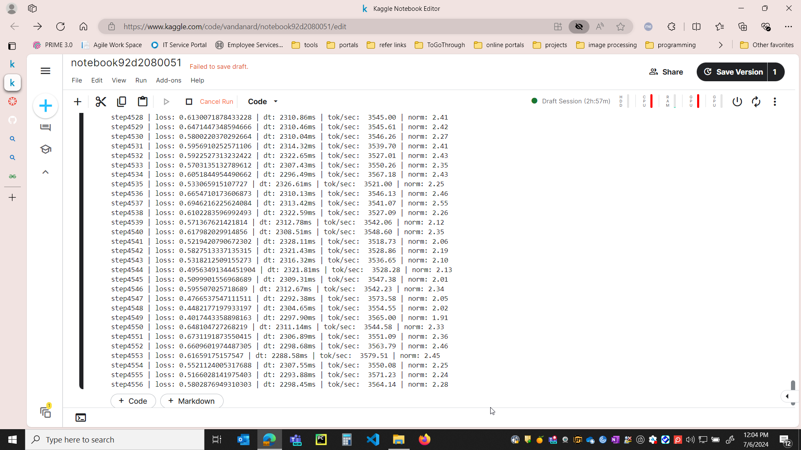
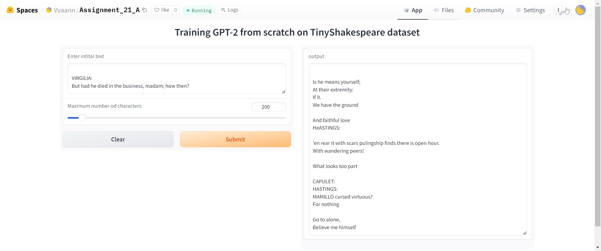

# Assignment 21_A

## Problem Statement

Understanding the GPT-2 model step by step and training it for loss less than 0.099
It is trained on tinyshakespeare data

This repo contains related files
        input.txt
        S21.ipynb
 

## Results

The code is trained in kaggle and the training file is **S21.ipynb**
Hugging space link: https://huggingface.co/spaces/Vvaann/Assignment_21_A

- Steps - 5000
- Number of tokens = 1024
- loss obtained = 0.3

gradio app 

